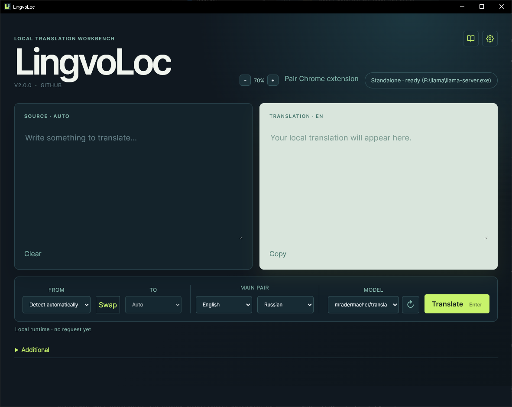

# LingvoLoc


## Overview

LingvoLoc is a Windows-first desktop application for private, local translation with a selectable local model (TranslateGemma and Gemma 3 are recommended; Hunyuan-MT and Qwen are also supported). Everything runs on your computer.



## Install

Download the latest `LingvoLoc_x.y.z_x64-setup.exe` from the [Releases](../../releases) page and run it. The installer checks for the components LingvoLoc needs and installs anything that is missing.

## First run

LingvoLoc works out of the box in **Standalone** mode and needs no other software:

1. Open **Settings** (gear icon, top right) and press **Download llama.cpp**. LingvoLoc picks the build that fits your computer (CUDA for NVIDIA, Vulkan for other GPUs, CPU otherwise), downloads it, and checks it.
2. Choose the **Models folder** containing your `.gguf` files.
3. Pick a model in the main window and translate.

The **GPU support** row shows your video card(s) and which llama.cpp build will be downloaded, and, once llama.cpp is installed, which device it actually uses. With several GPUs (for example a discrete card and an integrated one) LingvoLoc pins the strongest one. llama.cpp is installed into one fixed folder, so pressing **Update llama.cpp** later replaces it in place, reports when the latest release is already installed, and never changes the saved path.

The first translation is slower while the model loads: LingvoLoc starts the model server on the first translation, restarts it when you switch models, and stops it on exit. **Add to PATH** puts the llama.cpp folder into your user PATH (no administrator rights needed) so you can also run it from a terminal. **Advanced** lets you point to an existing llama.cpp folder or find one already in PATH.

Prefer LM Studio? Switch **Mode** to `LM Studio` and expose its OpenAI-compatible API at `http://127.0.0.1:1234/v1`.

## Choosing a model

The prompt format follows the model file name: names containing `gemma` use the TranslateGemma prompt, `hunyuan` uses Hunyuan-MT's official prompt, and any other instruction-tuned model (for example Qwen) uses a generic translator prompt. llama-server is started with matching chat-template flags, and Qwen3 thinking is switched off. After each translation the status line shows the response time and generation speed (`3779 ms · 30.7 tok/s`); the first request also includes model loading, so its speed is lower.

Benchmark on an RTX 3060 12 GB (llama.cpp, CUDA, 8K context, all layers on the GPU; 12 short and long texts covering idioms, technical, medical and legal wording, and a five-paragraph news article; en, ru, de and zh). Quality was judged by reading the output, without a reference metric, so treat it as a guide rather than a formal benchmark.

| Model                     | Size   | Speed     | Notes                                                                                                                    |
| ------------------------- | ------ | --------- | ------------------------------------------------------------------------------------------------------------------------ |
| TranslateGemma 4B Q8_0    | 3.9 GB | ~55 tok/s | Fastest; good for short text, occasional wording errors.                                                                 |
| TranslateGemma 12B Q4_K_S | 6.5 GB | ~34 tok/s | Good quality and speed.                                                                                                  |
| TranslateGemma 12B Q4_K_M | 6.8 GB | ~33 tok/s | No better than Q4_K_S; not worth it.                                                                                     |
| TranslateGemma 12B Q5_K_M | 7.9 GB | ~26 tok/s | **Best balance:** close to Q6_K, about 25% faster.                                                                       |
| TranslateGemma 12B Q6_K   | 9.0 GB | ~20 tok/s | Best wording, but 70% slower than Q4_K_S.                                                                                |
| Gemma 3 12B QAT Q4_0      | 6.4 GB | ~34 tok/s | Quality on par with TranslateGemma 12B; the QAT 4-bit build loses almost nothing, so larger quantizations are pointless. |
| Hunyuan-MT-7B Q6_K        | 5.7 GB | ~42 tok/s | Wordy for Russian, merged paragraphs and added details in a long text; better suited to Asian languages.                 |
| Qwen3-14B Q4_K_M          | 8.4 GB | ~32 tok/s | Weakest for Russian: invented idioms and stray non-Cyrillic characters.                                                  |

Recommendations:

- **Russian and other European languages:** TranslateGemma 12B Q5_K_M, or Gemma 3 12B QAT Q4_0 if you want a smaller and faster model.
- **Maximum speed on short text:** TranslateGemma 4B Q8_0.

## Settings

The **Settings** window (gear icon) has three sections:

- **Model runtime**: Standalone or LM Studio mode, models folder, GPU support, and llama.cpp.
- **Dictionaries**: choose the folder with your StarDict dictionaries and enable the ones to search. Articles from different dictionaries are shown as separate cards, each labeled with its dictionary name.
- **Browser extension**: **Copy token** copies the pairing token for the browser extension.

## Tray icon

Left-click the tray icon to show or hide the main window. Right-click opens the menu:

- **Open LingvoLoc** (`Ctrl+Shift+L`)
- **Translate clipboard** (`Ctrl+Shift+T`): translates the clipboard text and shows it in a small popup window.
- **Settings…**: opens the main window with the settings.
- **Start with Windows**: starts LingvoLoc hidden in the tray when you sign in.
- **Quit**

## Browser extension

The Chromium extension (`LingvoLoc-extension-x.y.z.zip` on the Releases page) translates selected text through the desktop app. Load it from `chrome://extensions` with Developer mode enabled, press **Copy token** in LingvoLoc Settings, and paste the token into the extension.

Select text and use the toolbar button or the right-click menu **Translate selection with LingvoLoc**. Both open the same in-page window, which you can drag by its header and resize by its right edge, bottom edge, or corner; the text and translation fields grow with it and the size is remembered. The **⧉** button opens the current content in a separate browser window that stays open and keeps its content when you switch tabs. On pages where extensions cannot inject content (such as `chrome://` pages) the separate window opens instead. See `docs/BROWSER_EXTENSION.md` for details.

## Usage

The status pill in the header shows the runtime and the selected model. The app persists endpoint, model, adapter, language selections, two independently selected pair languages, and text-size settings locally. Automatic source detection is enabled by default; successful translations are copied to the clipboard when WebView2 allows clipboard access. The clipboard popup has its own text-size setting, can be resized, and fits its height to its content.

Switch to **Files** in the header (or press Ctrl+2) to translate documents: choose several files or drop them on the window, follow the recent-jobs list, and translate all ready files in a row (each result is saved next to its source as `<name>.translated.<lang>.<ext>`). The Files view translates TXT, DOCX, EPUB, and plain FB2 files through the same local model. FB2 section headings, paragraphs, epigraphs, and notes are translated while metadata, links, images, and embedded resources are preserved. Unsupported FB2 content is left unchanged and reported in the job diagnostics; archived FB2 files are not supported.

### Translating files

- **Modes.** The header has a **Text | Files** switch (also Ctrl+1 and Ctrl+2); the last mode is remembered. Both views stay loaded, so a file keeps translating while you switch to Text, and the Files tab shows its progress. Text requests run before the next block of a file, so text translation stays usable but is slower while a file is being translated.
- **Adding files.** Press **Choose…** (several files at once are allowed) or drop files anywhere on the window. Supported formats are TXT, DOCX, EPUB, and plain FB2. Each file becomes its own job; the source language is detected automatically and the target follows your main language pair.
- **Jobs and queue.** **Recent jobs** lists your latest jobs with their status and progress. Open a job to see it, remove it, or use **Clear finished**. When two or more files are ready, **Translate N ready files in a row** translates them one after another and saves each next to its source as `<name>.translated.<lang>.<ext>`; an existing output file is never overwritten, and a pause, cancel, or error stops the queue.
- **Progress and completion.** The card shows blocks translated, an estimate while running, and finally "Translated N / N blocks in <time>". Pause and Cancel disappear once everything is translated; single files are saved with **Export translated…** to a location you choose. Jobs survive restarts and can be resumed.
- **Warnings.** Unsupported content (for example SVG with text, or scripts) is left unchanged and listed under the job; paragraphs that contain italics or links are summarized in one line, because their formatting position may shift.
- **Troubleshooting.** A request to the model that is silent for 45 seconds is treated as stalled; in Standalone mode the local server is restarted and the request is retried once. Diagnostic events are written to `lingvoloc-document-worker.log` in your temporary folder (`%TEMP%`).

Dictionary articles from your StarDict folders are colour-coded for the dark theme (pronunciation, part of speech, usage labels, examples, and cross references), and the repeated headword and sense markers such as `< I >` are hidden.

## Development

The sections below are for contributors building LingvoLoc from source.

### Requirements

Node.js 22+, Rust, WebView2, and the Windows C++ build tools. Then run:

```powershell
npm install
```

Run the web UI with `npm run dev` or the native desktop shell with `npm run desktop:dev`.

### Standalone runtime internals

In Standalone mode LingvoLoc downloads the newest llama.cpp Windows x64 release from GitHub into its app data folder (`llama.cpp/`, a fixed folder whose release is recorded in `version.txt`), chooses the archive from the detected GPU, starts `llama-server` on a free local port when the first translation runs, restarts it when you switch models, and stops it on exit.

### Build

Use `npm run build` for the frontend production build. The application version is managed in the package, Tauri, and extension manifests and is shown in the desktop UI. Use `npm run desktop:build` to compile the Tauri executable and create the x64 NSIS installer at `apps/desktop/src-tauri/target/release/bundle/nsis/`. The installer lets the user choose between a per-user installation in Local AppData and an all-users installation in Program Files, links the C runtime statically, and downloads the WebView2 runtime when it is not installed.

### Testing

Run `npm test` for Vitest and `cargo test --manifest-path apps/desktop/src-tauri/Cargo.toml` for Rust tests. Run the full local checks with `npm run check`.

To build the compact lexical index from downloaded source files, run `npm run lexical:index -- --stardict-dir <directory> --stardict-dir <directory> --output <index.json>`. The converter accepts FreeDict StarDict directories, Kaikki JSONL (`--kaikki-language <code>`), and a tab-separated morphology file with `lemma<TAB>form` rows (`--morphology-language <code>`). It keeps language and lemma as separate identity fields, so additional legally compatible language pairs can be added without collisions. It preserves definitions, examples, forms, translations, and provider labels; retain the upstream license and attribution notices alongside the generated index.

Use `Choose folder` in the **Dictionaries** section of **Settings** (gear icon, top right) to select the directory containing your StarDict dictionary folders. Extract each archive into its own subdirectory, preserving `.ifo`, `.idx` or `.idx.gz`, and `.dict` or `.dict.dz`; keep referenced media files such as `.wav`, `.mp3`, `.ogg`, `.flac`, `.m4a`, `.aac`, `.jpg`, `.jpeg`, `.png`, `.gif`, or `.webp` beside the dictionary data, or keep them in the dictionary's `res.zip`. Then press `Refresh dictionaries` and enable the dictionaries with checkboxes. The lookup scans only enabled dictionaries selected by the user; parsed dictionaries are cached in memory and reloaded when their files change. The `Additional` section with the dictionary lookup opens automatically when a lookup starts. Audio controls and images are loaded on demand when a dictionary entry references available media. LingvoLoc no longer creates or uses an app-data dictionary directory.

The native executable and NSIS installer build successfully on this machine with the branded LingvoLoc icon. The Chromium extension is packaged with `npm run extension:package` and uses the local loopback API after pairing. Its source and target languages are independent from desktop settings; the context-menu popup is in-page, movable, resizable, and supports copying the result.

The project is licensed under MIT; see `LICENSE`.

## Project Documentation

- `AGENTS.md`: shared instructions for coding agents.
- `STATUS.md`: current state, issues, and next step.
- `DECISIONS.md`: important technical decisions and rationale.
- `TODO.md`: pending work.
- `docs/IMPLEMENTATION_PLAN.md`: agreed Phase 0-1 implementation plan.
- `docs/LOCAL_API.md`: authenticated loopback API contract for the future browser extension.
- `apps/extension/`: Chromium MV3 extension source; build with `npm run extension:build`.
