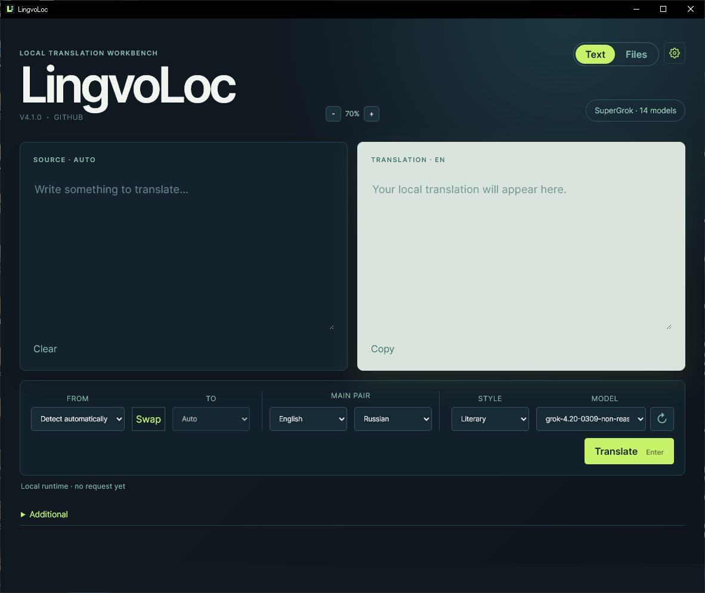
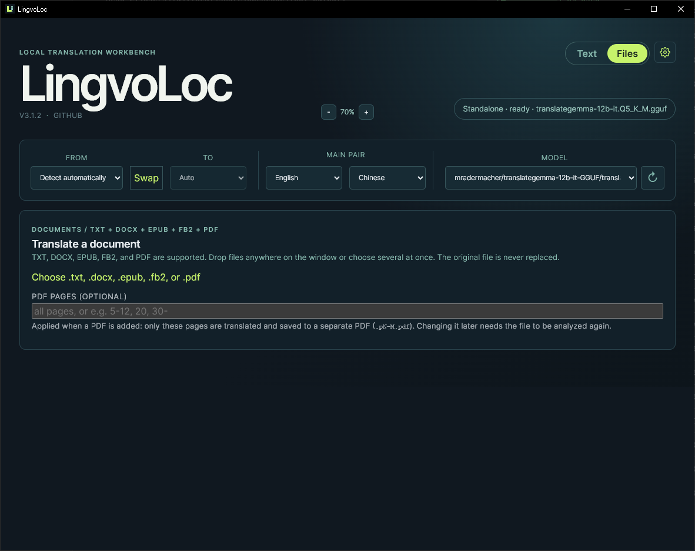

# LingvoLoc

[English](README.md) · **Русский**

LingvoLoc - приложение для Windows для **приватного перевода на вашем компьютере**. Вы выбираете модель перевода, и всё - тексты, документы, поиск по словарям - обрабатывается локально. Ничего не отправляется в интернет, не нужны ни учётная запись, ни подписка, а после загрузки модели программа работает без сети.

## Возможности

- **Перевод текста.** Введите или вставьте текст, выберите языки (автоматическое определение исходного языка для 12 языков) и получите перевод с временем ответа и скоростью. Результат копируется в буфер обмена.
- **Перевод целых документов.** Перетащите на окно файлы TXT, DOCX, EPUB, FB2 и **PDF**. Перевод книги идёт в фоне, переживает перезапуск, его можно приостановить, продолжить или отменить. Несколько файлов переводятся подряд.
- **Перевод PDF-книг с сохранением вёрстки.** Заголовки, колонки, таблицы, оглавления, цветные плашки, списки и картинки остаются на месте, заменяется только текст (подробности ниже).
- **Перевод из буфера обмена.** Нажмите `Ctrl+Shift+T` в любом месте Windows, и маленькое окно покажет перевод скопированного текста.
- **Перевод в браузере.** Расширение для Chromium переводит выделенный текст на любой странице через настольное приложение.
- **Поиск по вашим словарям.** Укажите папку со словарями StarDict: статьи показываются отдельными цветными карточками с транскрипцией, примерами и озвучкой.
- **Любая удобная модель.** LingvoLoc запускает модели `.gguf` (TranslateGemma, Gemma 3, Hunyuan-MT, Qwen и другие) через встроенный llama.cpp или подключается к LM Studio.
- **Работа в фоне.** Закрытие окна сворачивает LingvoLoc в трей; программа может запускаться вместе с Windows.

## Системные требования

- **Windows 10 или 11, 64-разрядная.** Установщик добавит среду WebView2, если её нет (для этого одного шага нужен интернет).
- **Место на диске:** менее 100 МБ под приложение, 0,2-1 ГБ под llama.cpp (скачивается из настроек) и 4-9 ГБ на каждую модель перевода (файл `.gguf`; см. таблицу ниже).
- **Память:** модель должна поместиться в видеопамять (GPU) или в оперативную память (CPU). Считайте размер файла плюс 1-2 ГБ. Видеокарта на 12 ГБ спокойно тянет рекомендуемые модели 12B (проверено на RTX 3060 12 ГБ); карты на 6-8 ГБ подойдут для TranslateGemma 4B или более лёгких квантований моделей 12B; без видеокарты желательно 16 ГБ ОЗУ и больше, а перевод будет в несколько раз медленнее.
- **Видеокарта (необязательна, но очень желательна):** NVIDIA (сборка CUDA 12), любая другая с поддержкой Vulkan (AMD, Intel) или без видеокарты (сборка для CPU). LingvoLoc выбирает сборку автоматически.
- **Интернет:** только для загрузки llama.cpp, моделей и самого установщика. Переводить можно без сети.
- **Расширение для браузера:** Chrome, Edge или другой браузер на Chromium (Manifest V3).
- **PDF:** текстовые PDF до 3000 страниц в одном файле; сканы (PDF только из картинок) не поддерживаются.

## Установка

Скачайте последний `LingvoLoc_x.y.z_x64-setup.exe` на странице [Releases](../../releases) и запустите его. Установщик проверяет нужные компоненты (например, WebView2) и доустанавливает недостающие. Можно установить для текущего пользователя или для всех.

## Первый запуск

В режиме **Standalone** LingvoLoc работает сразу и не требует другого ПО:

1. Откройте **Settings** (значок шестерёнки справа вверху) и нажмите **Download llama.cpp**. LingvoLoc выберет сборку под ваш компьютер (CUDA для NVIDIA, Vulkan для остальных видеокарт, иначе CPU), скачает и проверит её.
2. Выберите **Models folder** - папку с файлами `.gguf`.
3. Выберите модель в главном окне и переводите.

Строка **GPU support** показывает ваши видеокарты, какая сборка llama.cpp будет скачана, а после установки - какое устройство используется на самом деле. Если видеокарт несколько (например, дискретная и встроенная), LingvoLoc выбирает самую мощную. Кнопка **Update llama.cpp** позже заменяет установленную копию и сообщает, что уже стоит самая новая версия.

Первый перевод медленнее, пока загружается модель. **Add to PATH** добавляет папку llama.cpp в пользовательский PATH (права администратора не нужны), чтобы запускать её и из терминала. В **Advanced** можно указать существующую папку llama.cpp или найти её в PATH.

Предпочитаете LM Studio? Переключите **Mode** на `LM Studio` и запустите его OpenAI-совместимый сервер по адресу `http://127.0.0.1:1234/v1`.

## Выбор модели

Имя файла определяет формат запроса: имена с `gemma` используют промпт TranslateGemma, `hunyuan` - официальный промпт Hunyuan-MT, любая другая instruct-модель (например, Qwen) - универсальный промпт переводчика. После каждого перевода в строке состояния видны время ответа и скорость генерации (`3779 ms · 30.7 tok/s`); первый запрос включает загрузку модели, поэтому он медленнее.

Тест на RTX 3060 12 ГБ (llama.cpp, CUDA, контекст 8K, все слои на GPU; 12 коротких и длинных текстов: идиомы, техническая, медицинская и юридическая лексика, новостная статья из пяти абзацев; en, ru, de, zh). Качество оценивалось чтением результата без эталонной метрики, поэтому это ориентир, а не формальный бенчмарк.

| Модель                    | Размер | Скорость  | Заметки                                                                                                              |
| ------------------------- | ------ | --------- | -------------------------------------------------------------------------------------------------------------------- |
| TranslateGemma 4B Q8_0    | 3,9 ГБ | ~55 tok/s | Самая быстрая; хороша для коротких текстов, бывают неточности формулировок.                                          |
| TranslateGemma 12B Q4_K_S | 6,5 ГБ | ~34 tok/s | Хорошее качество и скорость.                                                                                         |
| TranslateGemma 12B Q4_K_M | 6,8 ГБ | ~33 tok/s | Не лучше Q4_K_S; смысла нет.                                                                                         |
| TranslateGemma 12B Q5_K_M | 7,9 ГБ | ~26 tok/s | **Лучший баланс:** близка к Q6_K, примерно на 25% быстрее.                                                           |
| TranslateGemma 12B Q6_K   | 9,0 ГБ | ~20 tok/s | Лучшие формулировки, но на 70% медленнее Q4_K_S.                                                                     |
| Gemma 3 12B QAT Q4_0      | 6,4 ГБ | ~34 tok/s | Качество на уровне TranslateGemma 12B; 4-битная QAT-сборка почти ничего не теряет, большие квантования бессмысленны. |
| Hunyuan-MT-7B Q6_K        | 5,7 ГБ | ~42 tok/s | Многословна для русского, в длинном тексте склеивает абзацы и добавляет детали; лучше подходит для азиатских языков. |
| Qwen3-14B Q4_K_M          | 8,4 ГБ | ~32 tok/s | Слабее всех для русского: выдуманные идиомы и посторонние нерусские символы.                                         |

Рекомендации:

- **Русский и другие европейские языки:** TranslateGemma 12B Q5_K_M или Gemma 3 12B QAT Q4_0, если нужна модель меньше и быстрее.
- **Максимальная скорость на коротких текстах:** TranslateGemma 4B Q8_0.
- Избегайте «abliterated»-версий: они пропускают заключительные абзацы длинных текстов.

## Перевод файлов

Переключитесь на **Files** в заголовке (или `Ctrl+2`; `Ctrl+1` возвращает к тексту). Оба режима остаются загруженными, поэтому файл продолжает переводиться, пока вы работаете с текстом, а на вкладке Files виден прогресс.

- **Добавление файлов.** Нажмите **Choose…** (можно выбрать несколько файлов) или перетащите файлы в любое место окна. Поддерживаются TXT, DOCX, EPUB, обычный FB2 и текстовый PDF. Каждый файл становится отдельным заданием; исходный язык определяется автоматически, целевой берётся из основной языковой пары.
- **Задания и очередь.** **Recent jobs** показывает последние задания со статусом и прогрессом. Задание можно открыть, удалить или очистить завершённые кнопкой **Clear finished**. Когда готовы два и больше файлов, **Translate N ready files in a row** переводит их один за другим и сохраняет каждый рядом с исходным как `<имя>.translated.<язык>.<расширение>`. Очередь никогда не перезаписывает существующий файл; пауза, отмена или ошибка останавливают её.
- **Прогресс и сохранение.** Карточка показывает переведённые блоки, оценку времени и в конце «Translated N / N blocks in <время>». Отдельные файлы сохраняются кнопкой **Export translated…** в выбранное место; если в диалоге сохранения выбрать существующий файл и подтвердить, он будет заменён. Задания переживают перезапуск и могут быть продолжены.
- **Предупреждения.** Содержимое, которое нельзя перевести безопасно (например, SVG с текстом, неразрешённые сущности FB2), остаётся без изменений и перечисляется в задании. Абзацы, где могут сместиться курсив или ссылки, сводятся в одну строку.
- **Форматы.** DOCX и EPUB сохраняют структуру пакета, стили, картинки и ссылки; заменяется только текст поддерживаемых абзацев, заголовков, пунктов списков и ячеек таблиц. В FB2 переводятся заголовки, абзацы, эпиграфы и примечания, а метаданные, ссылки, изображения и вложенные ресурсы сохраняются (архивы `.fb2.zip` не поддерживаются). TXT: UTF-8 и UTF-16 с BOM.
- **Зависшая модель.** Запрос к модели, молчащий 45 секунд, считается зависшим; в режиме Standalone локальный сервер перезапускается, запрос повторяется один раз. Диагностика пишется в `lingvoloc-document-worker.log` во временной папке (`%TEMP%`).

### Перевод PDF-книг

LingvoLoc переводит **текстовые PDF прямо на месте**: исходный текст удаляется, а перевод рисуется там же, поэтому переведённая книга выглядит как оригинал.

- **Что сохраняется.** Картинки, фоны, цветные плашки (советы, предупреждения, кейсы), рамки и заливка таблиц, линии, украшения страниц и блоки кода остаются нетронутыми. Заголовки сохраняют размер и начертание; центрированный текст и текст по правому краю остаются такими же; маркеры и номера списков перемещаются вместе со своим пунктом; ячейки таблиц, строки оглавления, подписи и страницы в несколько колонок переводятся по ячейкам и колонкам, не смешиваясь.
- **Как помещается более длинный текст.** Перевод обычно длиннее оригинала. LingvoLoc сначала использует свободное место под абзацем, затем более плотные интервалы между абзацами и строками и только потом уменьшает шрифт. Похожие ячейки и строки (например, вся таблица или оглавление) получают один размер шрифта, чтобы выглядеть ровно. Абзац никогда не наезжает на картинку, край плашки, линию таблицы или следующий абзац.
- **Абзацы, разорванные границей страниц,** склеиваются и переводятся как единое целое, поэтому предложения не обрываются посередине.
- **Шрифты.** Перевод набирается шрифтами Noto Sans и Noto Serif (встроены, лицензия SIL Open Font License) с полной поддержкой латиницы и кириллицы, поэтому результат не зависит от шрифтов, установленных на компьютере.
- **Диапазон страниц (рекомендуется для книг).** Поле **PDF pages** принимает диапазоны вида `5-12, 20, 30-`. Оно читается **при добавлении файла**: переводятся и сохраняются только эти страницы, в файл `<имя>.translated.<язык>.p5-12.pdf`. Так удобно быстро проверить результат на нескольких страницах, прежде чем переводить всю книгу. Если вы изменили диапазон позже, нажмите **Start translation** один раз: LingvoLoc заново проанализирует файл с новым диапазоном и попросит нажать **Start translation** ещё раз, так что неверный диапазон не будет переведён случайно.
- **Остаётся без изменений.** Код, номера страниц, короткие подписи заглавными буквами, сканы и страницы-картинки, текст внутри картинок и повёрнутые страницы не переводятся; об этом сообщается в заметках. Страницы, где перевод пришлось сильно уменьшить, перечисляются, чтобы вы могли их проверить.
- **Сохранение.** **Export translated…** записывает новый PDF; если в диалоге выбрать существующий файл и подтвердить, он будет заменён. Исходный PDF никогда не изменяется.
- **Требования.** Для PDF нужен `pdfium.dll` (входит в установщик, лежит в папке `pdfium` рядом с программой).

## Перевод текста и буфер обмена

Индикатор в заголовке показывает режим и выбранную модель. LingvoLoc запоминает адрес, модель, выбранные языки, два независимо выбранных основных языка и размер текста. Автоопределение исходного языка включено по умолчанию; успешный перевод копируется в буфер обмена, если Windows это позволяет. Двойной щелчок по слову в исходном тексте или в результате подсвечивает соответствие в другом тексте и открывает поиск по словарю.

У окна перевода буфера обмена (`Ctrl+Shift+T`) свой размер текста, его можно растягивать, а высота подстраивается под содержимое.

## Словари

В **Settings → Dictionaries** выберите папку, в которой лежат папки ваших словарей StarDict, и включите нужные. Распакуйте каждый архив в отдельную подпапку и сохраните `.ifo`, `.idx` или `.idx.gz` и `.dict` или `.dict.dz`; медиафайлы (`.wav`, `.mp3`, `.ogg`, `.flac`, `.m4a`, `.aac`, изображения) могут лежать рядом со словарём или в его `res.zip`. LingvoLoc не поставляется со своими словарями и никогда не подменяет отсутствующую статью сгенерированным текстом. Статьи из разных словарей показываются отдельными карточками с названием словаря и цветовой разметкой для тёмной темы (транскрипция, часть речи, пометы, примеры, ссылки); повторяющийся заголовок и маркеры значений вроде `< I >` скрыты. Аудио и изображения загружаются по требованию.

## Настройки

В окне **Settings** (значок шестерёнки) три раздела:

- **Model runtime**: режим Standalone или LM Studio, папка моделей, поддержка GPU и llama.cpp.
- **Dictionaries**: папка StarDict и словари для поиска.
- **Browser extension**: **Copy token** копирует токен сопряжения для расширения браузера.

## Значок в трее

Левый щелчок по значку в трее показывает или скрывает главное окно. Правый щелчок открывает меню:

- **Open LingvoLoc** (`Ctrl+Shift+L`)
- **Translate clipboard** (`Ctrl+Shift+T`): переводит текст из буфера обмена и показывает его в небольшом окне.
- **Settings…**: открывает главное окно с настройками.
- **Start with Windows**: запускает LingvoLoc скрыто в трее при входе в систему.
- **Quit**

## Расширение для браузера

Расширение для Chromium (`LingvoLoc-extension-x.y.z.zip` на странице Releases) переводит выделенный текст через настольное приложение. Загрузите его в `chrome://extensions` с включённым режимом разработчика, нажмите **Copy token** в настройках LingvoLoc и вставьте токен в расширение. После перезапуска настольного приложения сопряжение нужно выполнить заново.

Выделите текст и воспользуйтесь кнопкой на панели или пунктом контекстного меню **Translate selection with LingvoLoc**. Кнопка на панели открывает окно и заполняет его текстом, но не запускает перевод; пункт контекстного меню открывает окно и сразу переводит текст на сохранённый язык назначения. Во время перевода в области результата показывается понятный индикатор `Translating...`. Абзацы перевода отображаются с отступом первой строки для более удобного чтения. Нажмите **Original text**, чтобы свернуть или развернуть поле исходного текста; это состояние запоминается. Кнопка **Clear** очищает исходный текст и результат, а перетаскивание разделителя между ними меняет и запоминает их относительную высоту. Окно можно перетаскивать за заголовок и менять его размер за правый край, нижний край или угол; размер запоминается. Кнопка **⧉** открывает содержимое в отдельном окне браузера, которое остаётся при переключении вкладок; на страницах, куда расширения не могут внедряться (например, `chrome://`), вместо этого открывается такое окно. Подробности - в `docs/BROWSER_EXTENSION.md`.

## Приватность

Перевод, документы, словари и история остаются на вашем компьютере. Единственное обращение LingvoLoc к сети - необязательная загрузка llama.cpp с GitHub. Расширение обращается только к настольному приложению на `127.0.0.1` с токеном сопряжения.

Проект распространяется по лицензии MIT; см. `LICENSE`.

---

# Техническое описание

Разделы ниже предназначены для разработчиков и тех, кто хочет понять, как устроен LingvoLoc.

## Архитектура

- **Настольное приложение** (`apps/desktop`): фронтенд на React, Vite и строгом TypeScript (`src`), оболочка Tauri 2 и бэкенд на Rust (`src-tauri/src`) с нативными командами, рантаймами, адаптерами моделей, историей, определением языка, лексическими сервисами и подсистемой документов. npm workspaces, приоритет - Windows.
- **Расширение браузера** (`apps/extension`): тонкий клиент Chromium MV3. У него нет ни модели, ни данных; он использует аутентифицированный loopback API на `127.0.0.1:47831` (bearer-токен на процесс, ограниченный CORS); см. `docs/LOCAL_API.md`.
- **Рантаймы.** Реализации `ModelRuntime`: `standalone` (запускает `llama-server.exe` на свободном loopback-порту с `.gguf` из папки моделей; llama.cpp скачивает `runtimes/llama_download.rs`, выбирая архив CUDA 12, Vulkan или CPU по обнаруженной видеокарте) и `lmStudio` (OpenAI-совместимый API на `http://127.0.0.1:1234/v1`). Держится один процесс сервера, он перезапускается при смене модели и завершается при выходе.
- **Адаптеры.** `TranslationModelAdapter` выбирается по имени файла модели (`adapters::Family`): `gemma` → TranslateGemma, `hunyuan` → Hunyuan-MT, иначе универсальный чат-переводчик (для Qwen3 добавляются `/no_think` и `enable_thinking:false`). `llama-server` получает соответствующие флаги шаблона.
- **Координатор инференса.** Все точки входа (UI, API, буфер обмена, блоки документов) используют один внутрипроцессный координатор: один блокирующий запрос к модели за раз, интерактивные запросы в приоритете, документы занимают слот на каждый блок. Смена жизненного цикла приостанавливает его. Ответы чата идут потоком (`stream: true`) в отдельном потоке с простоем не более 45 с и общим пределом 900 с; Standalone перезапускает сервер и повторяет запрос один раз. События пишутся в `%TEMP%\lingvoloc-document-worker.log`.
- **История** - SQLite (`lingoloc.sqlite`, версия схемы в `PRAGMA user_version`, хранится 1000 записей без избранного). Настройки лежат в `lingoloc.settings`. Эти устаревшие имена и идентификатор пакета `com.lingoloc.desktop` намеренно не менялись, чтобы существующие установки сохранили данные.
- **Лексический поиск** читает только выбранные пользователем папки StarDict (разобранные папки кэшируются по пути и отпечатку файлов); встроенного словаря или словаря в данных приложения нет. `scripts/build-lexical-index.mjs` - офлайн-конвертер, к поиску во время работы он не относится.

## Задания документов

Документы выполняются как восстанавливаемые задания в `document-jobs.sqlite` (данные приложения): SHA-256 исходника, версия парсера и конфигурации, снимок рантайма, сохранённые блоки (идемпотентные транзакции на блок), диагностика. Состояния: ready, translating, paused, interrupted (выставляется при запуске для активных заданий), failed, cancelled, exporting, completed, completed_with_warnings. Для продолжения снимки рантайма и конфигурации должны совпадать. Слишком большие блоки аккуратно делятся (по предложениям, затем по пробелам, затем по границам символов; стабильные идентификаторы `parent::part-NNNN`). Воркер приостанавливается или отменяется между блоками; Pause, Cancel и Clear также прерывают `llama-server`, чтобы идущий запрос быстро завершился.

Модули форматов (`documents/`): `txt.rs`, `docx.rs` (quick-xml, сохранение пакета, нетронутые записи ZIP копируются как есть), `epub.rs` (XHTML из spine), `fb2.rs` и `pdf/`. Результат пишется через временный файл в той же папке и переименовывается; исходник никогда не заменяется, а существующий файл заменяется только по пути, подтверждённому в диалоге сохранения. Интерфейс Files (`DocumentsPanel.tsx`) опрашивает `get_document_progress`; `get_document_job` загружает все блоки только при открытии задания.

## Движок перевода PDF

`documents/pdf/` (PDFium привязывается один раз на процесс за мьютексом и загружается во время работы из `pdfium.dll`; путь можно переопределить через `LINGVOLOC_PDFIUM`):

1. **Анализ** (`mod.rs::read_page`, `layout.rs`, `regions.rs`). Объекты страницы PDFium превращаются во фрагменты, строки и абзацы. Абзацы классифицируются (заголовок, основной текст, код, подпись), определяются области и порядок чтения (колонки, плашки, ячейки таблиц, подписи), продолжения через границу страниц склеиваются. Блоки получают идентификаторы `pdf#pNNNN-KKK`; геометрия в базе заданий не хранится. Версия парсера и конфигурации - `pdf-v2` (диапазоны страниц хранятся как `pdf-v2;pages=…`). Любое изменение, влияющее на группировку, правила пропуска или порядок чтения, перенумеровывает блоки, поэтому существующие задания пришлось бы очистить и добавить заново.
2. **Размещение** (`slots.rs`, `reflow.rs`). Экспорт повторяет тот же анализ на файле с проверенным хэшем. Каждый переведённый абзац получает _слот_, который начинается в исходной позиции и может расти только в свободное место: вниз - до ближайшего абзаца, линии, края плашки, изображения или поля страницы; вправо - до соседних колонок, ячеек, вертикальных линий и отступов плашки. Плашки, нарисованные плитками из полос одного цвета, объединяются. Абзацы, стоящие в одной колонке друг под другом без препятствий, образуют _серию_ (run), которая раскладывается вместе: серия сначала плотно упаковывается, чтобы понять, что помещается, затем свободное место возвращает элементы к исходным позициям. Порядок перебора: масштаб (от 1,0 до 0,55) с сохранением промежутков между абзацами, пока шрифт не станет меньше 0,88, затем более плотные промежутки и межстрочный интервал. Центрирование и выравнивание по правому краю сохраняются, маркеры списков следуют за пунктом, похожие одиночные ячейки используют общий масштаб (не ниже 0,6), а плашка, доходящая до края страницы, считается разорванной границей страниц и не растёт.
3. **Вывод** (`mod.rs::export_with`, `fonts.rs`). Исходные текстовые объекты переведённых абзацев удаляются (никогда не закрываются белыми прямоугольниками), перевод рисуется встроенными шрифтами Noto с цветом оригинала, всё остальное на странице сохраняется. Вывод с диапазоном оставляет только выбранные страницы (`<имя>.translated.<язык>.pN-M.pdf`).

Цикл разработки без UI: соберите `cargo build --release --example pdf_try` в `apps/desktop/src-tauri`, затем запустите `pdf_try.exe <pdf> <out.pdf> "" "1-8"` с `LINGVOLOC_PDFIUM`; с `PDF_JOB_DB` и `PDF_JOB_ID` можно взять реальные переводы завершённого задания (без них подставляется поддельный кириллический перевод). Страницы рендерятся с помощью `tools/pdf-feasibility/examples/render.rs`. Правила вёрстки реализованы в `apps/desktop/src-tauri/src/documents/pdf/`.

## Разработка

Требования: Node.js 22+, Rust, WebView2 и средства сборки C++ для Windows (их даёт Visual Studio). Затем выполните `npm ci`.

- `npm run dev` запускает веб-интерфейс; `npm run desktop:dev` - нативную оболочку.
- `npm run check` - полный локальный набор проверок (форматирование, lint, проверка типов, тесты расширения, тесты desktop, форматирование Rust, тесты Rust). Отдельные проверки: `npm run lint`, `npm run typecheck`, `npm test`, `npm run extension:typecheck`, `npm run extension:test`, `cargo test --manifest-path apps/desktop/src-tauri/Cargo.toml`. Строгая проверка в стиле CI: `cargo clippy --manifest-path apps/desktop/src-tauri/Cargo.toml --all-targets -- -D warnings`.

### Сборка

Перед `npm run desktop:build` один раз выполните `powershell -File scripts/fetch-pdfium.ps1`: он скачивает закреплённую сборку PDFium с проверкой хэша в `apps/desktop/src-tauri/resources/pdfium/` (в gitignore), и установщик включает её в поставку. `npm run desktop:build` компилирует исполняемый файл Tauri и создаёт установщик NSIS x64 в `apps/desktop/src-tauri/target/release/bundle/nsis/`; `npm run desktop:verify-bundle` проверяет, что PDFium и уведомления о шрифтах на месте. Установщик предлагает установку для пользователя (Local AppData) или для всех (Program Files), статически линкует среду выполнения C и скачивает WebView2, если его нет. Перед пересборкой закройте приложение (запущенный exe заблокирован). `npm run build` собирает только фронтенд; `npm run extension:build` и `npm run extension:package` собирают и архивируют расширение.

Версия релиза продублирована в `package.json` корня, desktop и extension, в `manifest.json` расширения, `tauri.conf.json` и `Cargo.toml`; обновляйте их вместе (имя ZIP расширения берётся из `apps/extension/package.json`, а ZIP опубликованной версии пересобирать нельзя).

### Конвертер лексического индекса

`npm run lexical:index -- --stardict-dir <каталог> --output <index.json>` преобразует каталоги FreeDict StarDict, Kaikki JSONL (`--kaikki-language <код>`) и файлы морфологии с разделением табуляцией (`--morphology-language <код>`) в компактный индекс. Лицензию и атрибуцию каждого исходного набора данных храните рядом с результатом.

## Документация проекта

- `docs/IMPLEMENTATION_PLAN.md`, `docs/FILE_TRANSLATION_PLAN.md`: планы реализации.
- `docs/LOCAL_API.md`: аутентифицированный loopback API.
- `docs/BROWSER_EXTENSION.md`: подробности о расширении.
- Уведомления о сторонних компонентах: PDFium и шрифты Noto (`apps/desktop/src-tauri/resources/`), WordNet (`docs/WORDNET_NOTICE.txt`).
